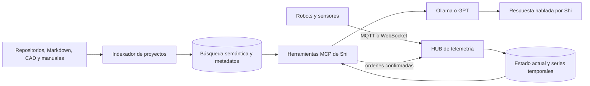

# Arquitectura futura: conocimiento, robots y HUB

## Objetivo

Shi debe poder responder preguntas sobre todos los proyectos y narrar estados de robots en tiempo real. No se consigue reentrenando Ollama después de cada cambio: se construye una capa de conocimiento y herramientas que entregue al modelo información actual, verificable y con fecha.



## Tres clases de memoria

1. **Conocimiento documental:** diseños, decisiones, pinouts, manuales, BOM, firmware y notas. Se indexa con versión, proyecto, archivo, fecha y enlace al origen.
2. **Memoria estable:** nombres, preferencias, configuración del taller y decisiones que siguen vigentes. Se guarda como datos estructurados editables, no solo dentro de conversaciones.
3. **Estado en vivo:** batería, modo, posición, errores y conectividad. Tiene marca de tiempo y caduca; nunca debe mezclarse como si fuera documentación permanente.

## Cómo mantenerla actualizada

- Cada proyecto conserva una carpeta `docs/` y un archivo de contexto corto.
- Un indexador detecta commits o cambios y actualiza solo los fragmentos modificados.
- El HUB expone una acción manual `sincronizar proyecto` y puede ejecutar sincronización programada.
- Toda respuesta documental debe poder indicar fuente y versión.
- Los datos reemplazados se marcan obsoletos; no se dejan dos pinouts contradictorios como igualmente válidos.

El primer almacén puede ser SQLite más un índice vectorial local. Al crecer a varios robots conviene PostgreSQL con `pgvector`; para telemetría histórica se puede añadir TimescaleDB o InfluxDB. La elección definitiva debe hacerse cuando exista el primer esquema real de mensajes.

## Telemetría de robots

MQTT encaja bien con dispositivos pequeños y estados frecuentes. Una convención inicial:

```text
robots/{robot_id}/state
robots/{robot_id}/battery
robots/{robot_id}/mode
robots/{robot_id}/alerts
robots/{robot_id}/telemetry/{sensor}
robots/{robot_id}/commands/{command}
```

Cada mensaje debería incluir al menos `robot_id`, `timestamp`, `value`, `unit`, `quality` y versión de esquema. El HUB normaliza fabricantes y placas distintas para que Shi pueda preguntar siempre mediante las mismas herramientas.

## Herramientas que usará Shi

- `projects.search(query, project, version)`
- `projects.get_pinout(project, board_revision)`
- `robots.list()`
- `robots.get_status(robot_id)`
- `robots.get_battery(robot_id)`
- `robots.get_alerts(robot_id)`
- `robots.get_history(robot_id, metric, range)`
- `robots.request_command(robot_id, command, parameters)`

Las consultas son de solo lectura. Las órdenes deben pasar por validación, límites físicos y confirmación de Jota. Parar un robot puede considerarse una excepción segura; mover brazos, motores o actuadores nunca debe deducirse de una frase ambigua.

## Fases recomendadas

1. Crear un catálogo de proyectos en Markdown/JSON y una herramienta local de búsqueda.
2. Añadir RAG local para que Ollama cite fragmentos concretos.
3. Definir el esquema MQTT y conectar un solo robot en modo lectura.
4. Crear el HUB con panel, historial y alertas.
5. Exponer las consultas del HUB a Shi mediante MCP.
6. Añadir órdenes con permisos y confirmaciones.
7. Incorporar avisos proactivos: batería baja, desconexión, temperatura o error de misión.

## Expectativa realista

Shi puede llegar a conocer con mucha precisión todo lo que esté documentado e indexado, pero “saber absolutamente todo” requiere disciplina: fuentes actualizadas, estados con fecha, versiones claras y herramientas que reconozcan cuando falta información. Si un dato no existe o está vencido, debe decirlo en vez de inventarlo.
